# Corrupt – Gym Workout Logger (WIP)
  
A sleek, **iOS-inspired React Native app** for tracking gym workouts.  
Built with **TypeScript**, the app allows users to customize routines, log exercises, and track progress completely offline.  

---

## Features (Current Progress)
   
### ✅ Implemented
-  **Routine customization** – add and organize exercises  
-  **Workout timer** with automatic rest tracking  
-  **Widget-based layout** for flexible home screen organization   
-  **Multiple themes** (light, dark, + 4 custom themes)  
-  **Offline-first** – no internet required  

### 🚧 In Progress
-  **Graphs and visual stats** for tracking performance  
-  **Data syncing** and export options  
-  **Online features** – profile sharing and copying workouts  

---

## App Screenshots

### Themes
The app includes 3 light and 3 dark themes:

| Light | Peachy | Oldschool |
|-------|--------|-----------|
| 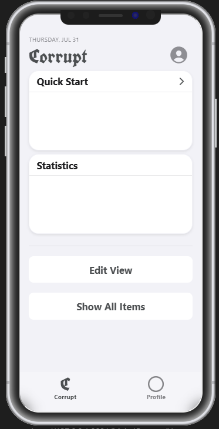 | 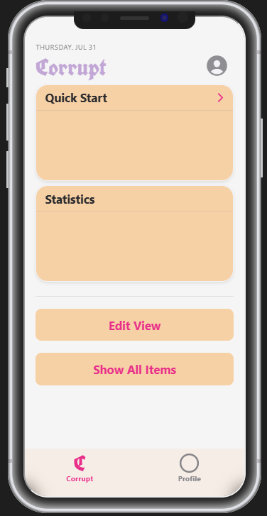 | 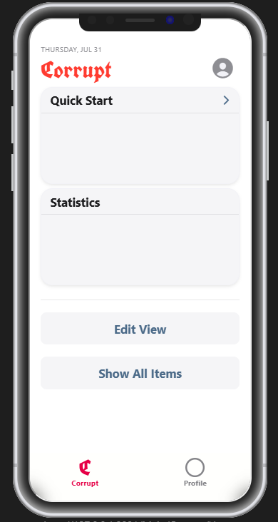 |

| Dark | Preworkout | Corrupted |
|------|------------|-----------|
| 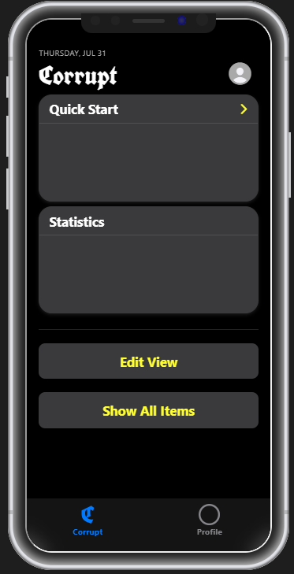 | 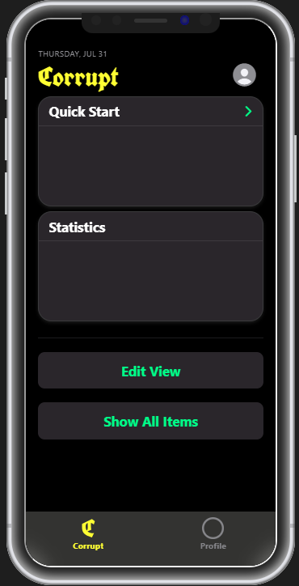 | 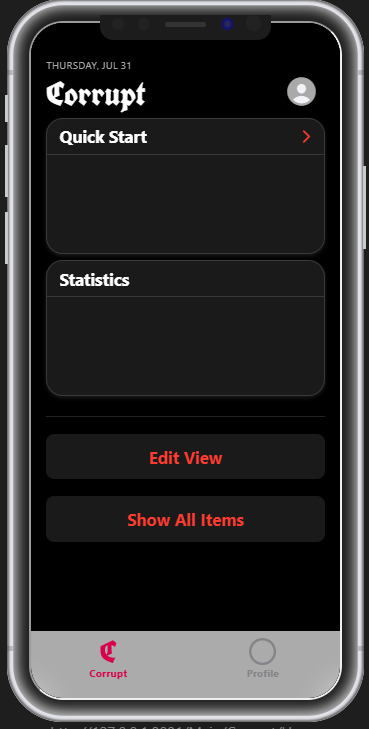 |


### Core Features
| Add Exercise to Routine | Superset Input Table | Exercise Input Table |
|--------------------------|---------------------|----------------------|
| 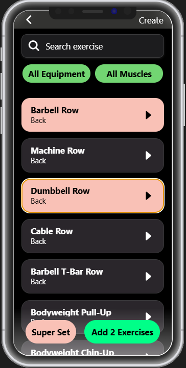 | 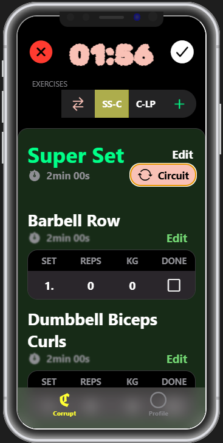 | 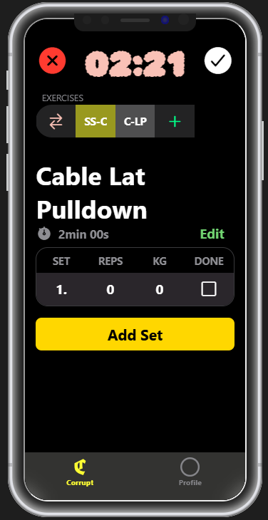 |


### Home Screen
| Edit Home Mode | Long Press on Widget | Active Routine (Timer) |
|----------------|----------------------|------------------------|
| 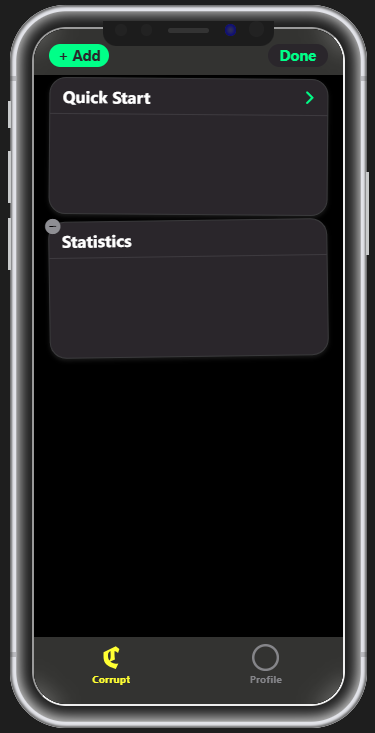 | 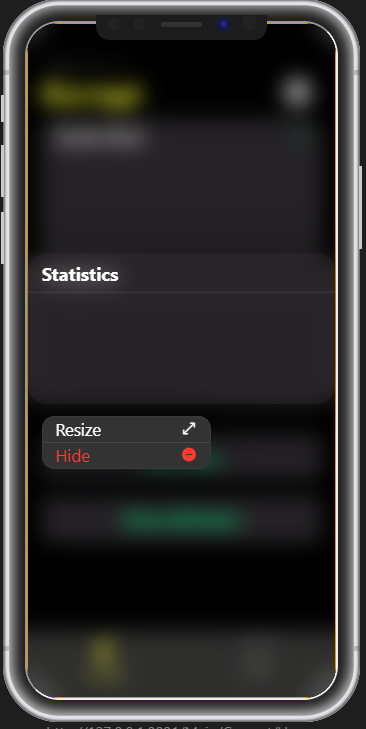 | 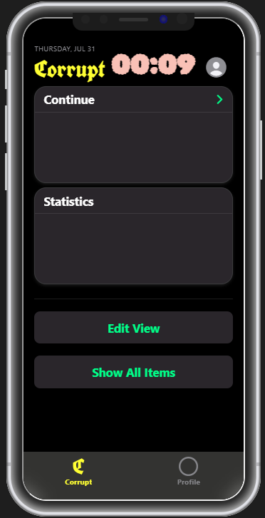 |

---

## Tech Stack

- [React Native](https://reactnative.dev/) + TypeScript  
- [Expo](https://expo.dev/)  
- [Zustand](https://github.com/pmndrs/zustand) for state management  
- [MMKV](https://github.com/mrousavy/react-native-mmkv) for fast offline storage  

---

## Getting Started

### 1. Clone the repository

```bash
git clone https://github.com/Luka-Prokic/gym-tracker-project.git
cd gym-tracker-project
